# **SignInApp**
### In that app we can observe different screens with sign in/up opportunities. We have simple logic and reusable code. We can also make a to-do list and delete it if we have done it.
---
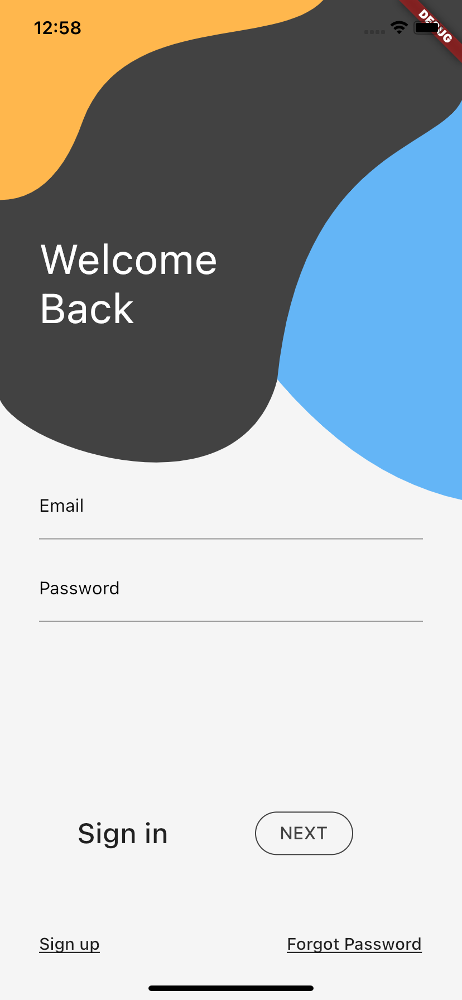
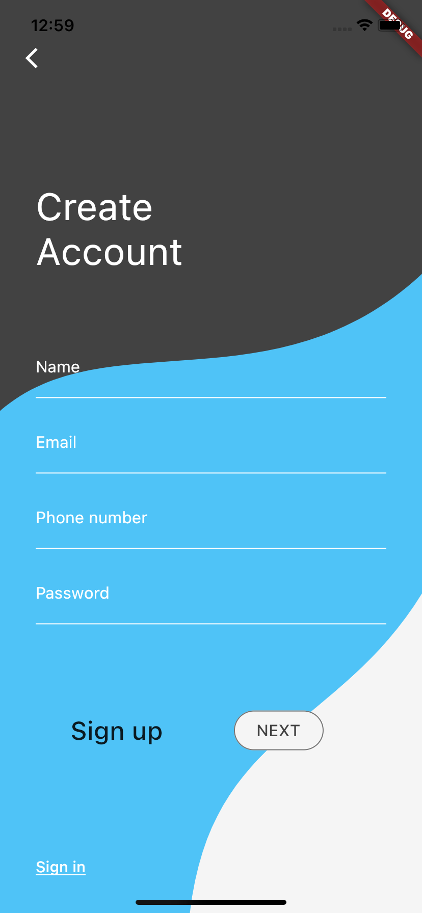
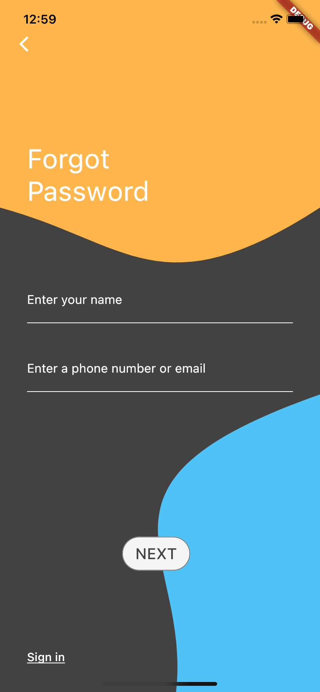
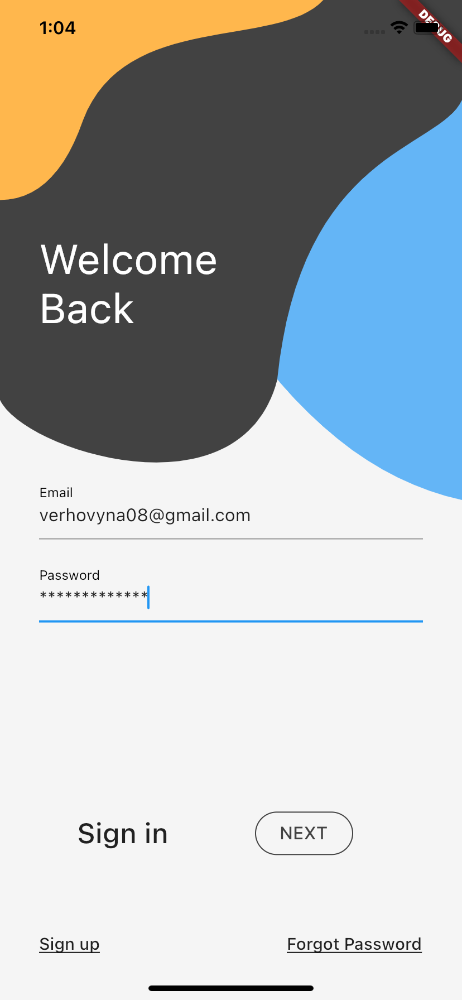
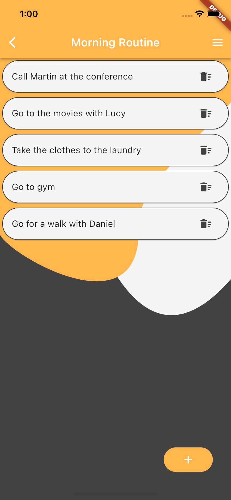
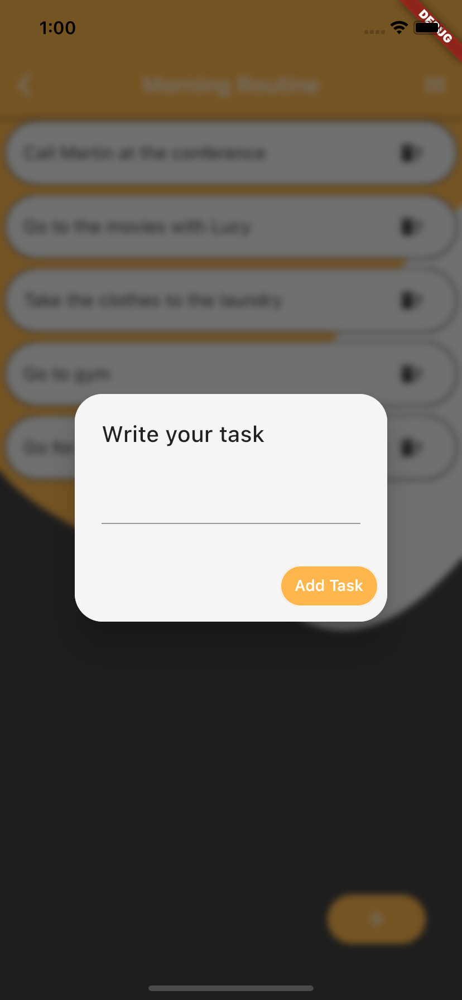
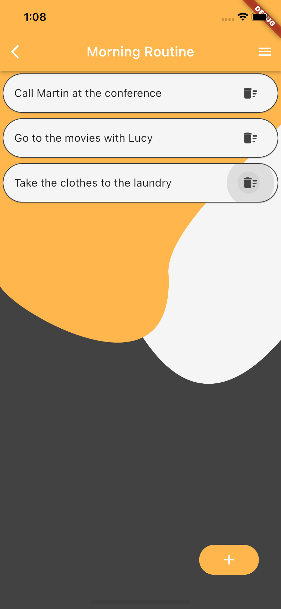
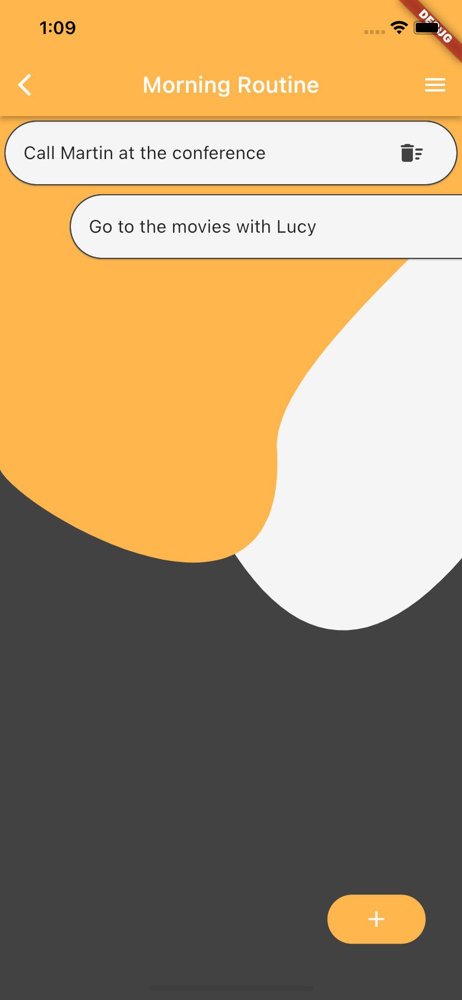
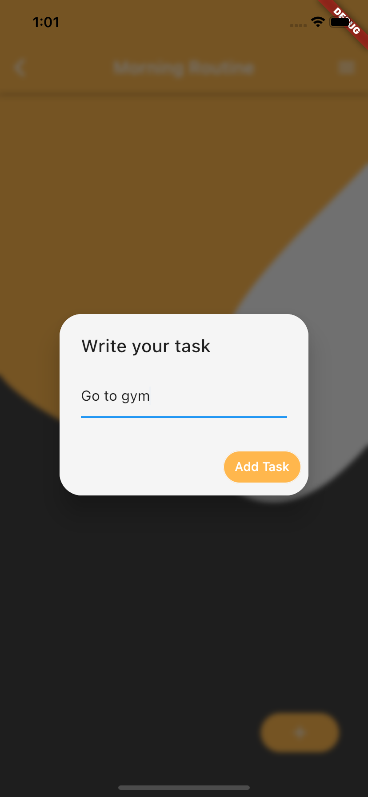
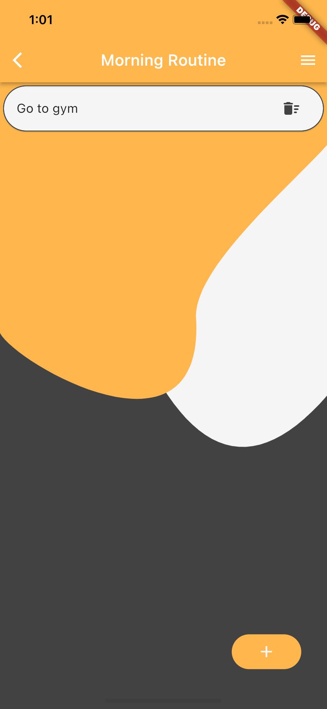
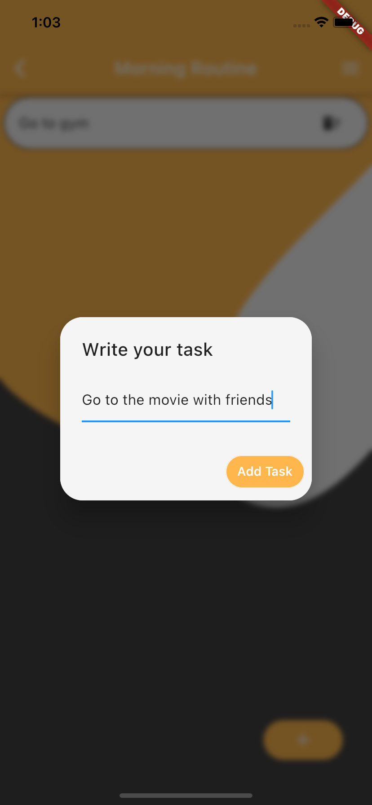
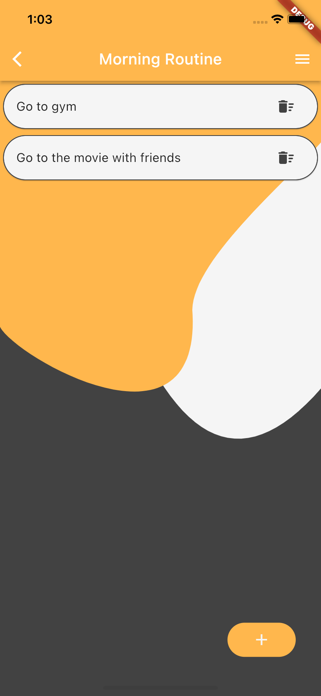

